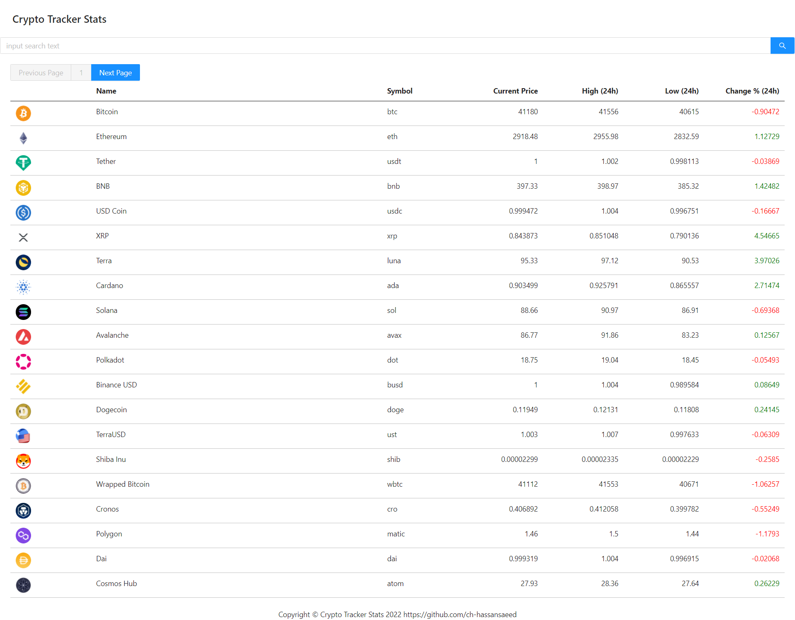
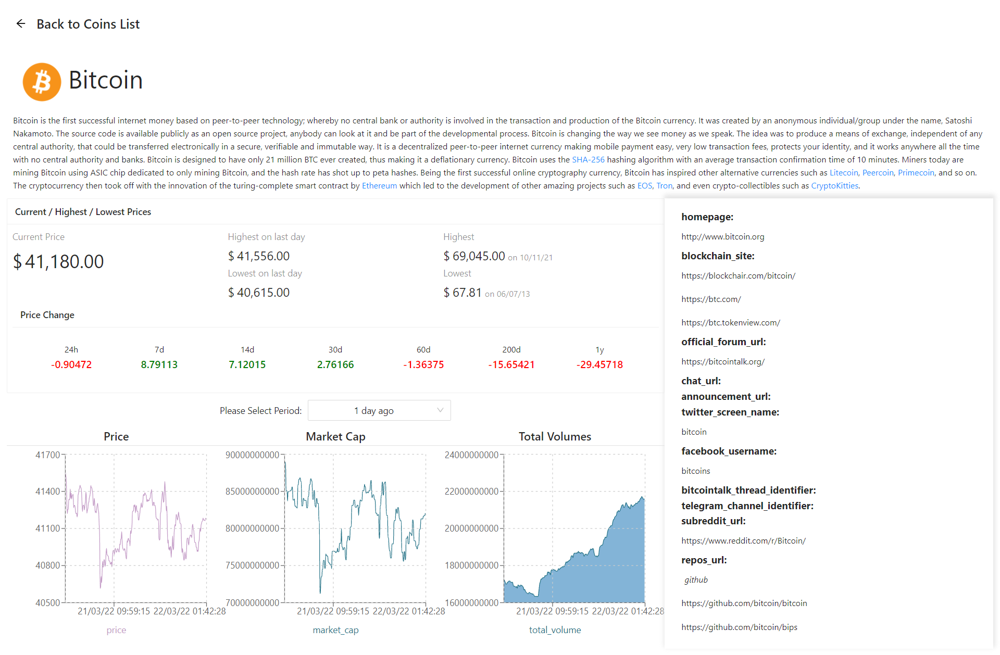

## Crypto Tracker Stats

Crypto Tracker Stats App can View All cryptocurrency coins rate,states,charts with pagination and search using the coingecko API, It is built using React , JavaScript, Typescript, Redux, Redux Saga,recharts, axios,ant design.
coingecko API: https://www.coingecko.com/en/api

## Demo ScreenShot

# `Home Page`

# `Detail Page`

## Installation and Setup Instructions

Install Node Js on your machine.

Install Pre-req Packages:

`npm install`

To Start App Server:

`npm start`

To Visit App Via Browser:

`localhost:3000`
